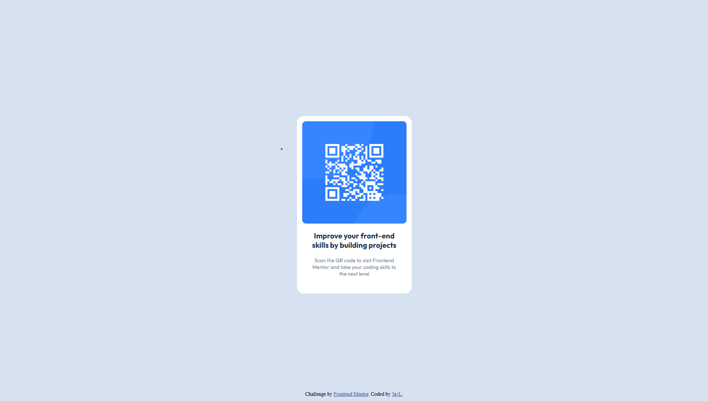

# Frontend Mentor - QR code component solution

This is my solution to the [QR code component challenge on Frontend Mentor](https://www.frontendmentor.io/challenges/qr-code-component-iux_sIO_H). Frontend Mentor challenges help you improve your coding skills by building realistic projects.

## Table of contents

- [Overview](#overview)
  - [Screenshot](#screenshot)
  - [Links](#links)
- [My process](#my-process)
  - [Built with](#built-with)
  - [What I learned](#what-i-learned)
  - [Continued development](#continued-development)
- [Author](#author)

## Overview

### Screenshot

### Links

- Live Site URL: [Add your live site URL here](https://jldevx.github.io/qr-code-project/)

## My process

### Built with

- Semantic HTML5
- CSS
- Flexbox
- rem units
- Mobile-first design

### What I learned

I learned how to make a fluid and scalable layout by using `rem` units. It helped me better understand how flexible sizing works in CSS and why it's important for consistency and accessibility.

### Continued development

In future projects, I want to improve the **responsiveness** of my designs and focus more on creating a clean, well-structured codebase. I also plan to explore more layout techniques and possibly use media queries more effectively.

## Author

- Jay
- Frontend Mentor - [@jldevx](https://www.frontendmentor.io/profile/jldevx)